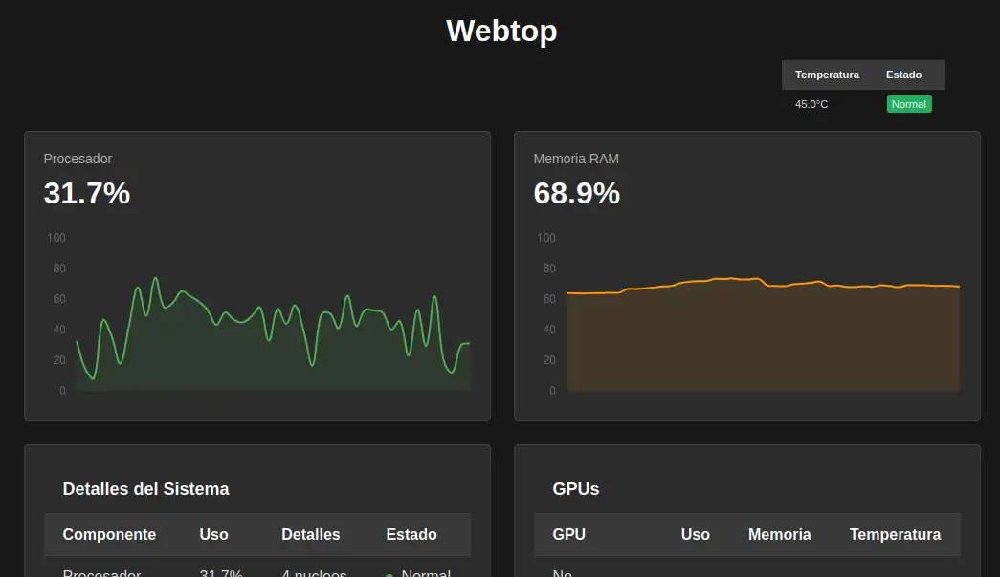

# Monitor CPU,GPU,RAM,TEMPERATURA

Un monitor simple para ver el uso de CPU, RAM y GPU en tiempo real. de tu servidor local, online (Linux)

## Que hace

- Muestra el uso del procesador en porcentaje
- Muestra el uso de memoria RAM en porcentaje  
- Muestra informacion de las tarjetas graficas NVIDIA
- Muestra la temperatura y alerta si es medio o alto
- Crea reportes de el uso, del cpu, ram, y la temperatura (proximamente)

##captura



## Instalacion

1. Descarga o clona este proyecto
2. Ve a la carpeta del proyecto
3. Instala las dependencias:
```bash
pip install -r requirements.txt
```

## Como usar

1. Ejecuta el servidor:
```bash
python app.py
```

2. Abre tu navegador y ve a:
```
http://localhost:5000
```

3. Para acceder desde otra computadora usa:
```
http://[IP-DEL-SERVIDOR]:5000
```


## Tecnologias y librerias

- Backend: Flask (Python)
- Frontend: HTML, CSS, JavaScript
- Graficas: Chart.js
- Monitoreo: psutil, nvidia-smi


## Licencia

Este proyecto es de codigo abierto.

## Contribuciones

Las contribuciones son bienvenidas. Puedes abrir un issue o hacer un pull request.
